# SARA: Smart Autonomous Retail Assistant

**An autonomous shopping cart robot for structured retail environments, built on ROS 2 / Nav2, running identically in Gazebo simulation and on a real TurtleBot3 Waffle.**

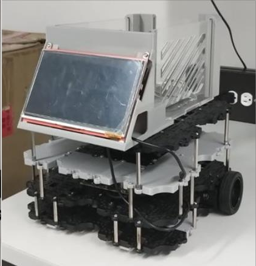

SARA guides people through a store. On a shared touchscreen app, a customer picks products to buy, or a worker checks off the shelf spots for items that ended up in the wrong place. Either way, the robot works out an efficient order to visit those points, navigates to each one on its own, and stops so the person can act (pick up a product, or put one back) before moving on. A weight sensor in the basket enforces a hard safety cutoff, reactive lidar avoidance runs alongside the planned navigation, and a separate app lets store staff manage the product catalog itself.

This repository is the reference implementation for my undergraduate thesis in Mechatronics Engineering at Universidad Autónoma de Occidente (Cali, Colombia):

> Capacho Parra, D. (2025). *Desarrollo de un sistema robótico para la conducción autónoma de carros de compra en entornos estructurados* (Undergraduate thesis). Universidad Autónoma de Occidente. [hdl.handle.net/10614/16136](https://hdl.handle.net/10614/16136)

---

## What it does

1. **Select destinations.** On the touchscreen app (`saragui.py`), a customer checks off products to buy, or a worker checks off the shelf locations of misplaced items they're carrying back.
2. **Route planning.** The robot orders the selected points with a nearest-neighbor plus 2-opt heuristic and hands the sequence to Nav2.
3. **Autonomous navigation.** Nav2 (AMCL localization, MPPI control, Dijkstra global planning) drives the robot to each waypoint on a map built with Cartographer SLAM. Anyone can also take over with a keyboard or gamepad at any time.
4. **Safety layer, always on.** A priority arbiter built on `twist_mux` lets a lidar obstacle avoidance state machine and a load cell weight cutoff override navigation or teleoperation commands at any moment.
5. **Finish.** For a customer this ends at checkout with a thank you and feedback screen. For a worker returning items, it ends once every point on the list has been visited.
6. **Catalog management, separately.** `workergui.py` is a different app for keeping the product database in sync with the store: add, relocate, or remove a product, capturing its shelf position in real time by driving the robot there and reading its live position on the map.

## Key features

- **Sim/real parity, different maps.** The same Nav2 stack, safety layer, and control code run unmodified against both a Gazebo model and the physical robot. Each environment is mapped independently with Cartographer (simulation uses `maps/supermarket_map.yaml`, the real lab replica uses `maps/labrobfinal_mask.yaml`), but both share the same 7x3 m layout: three shelf units and a checkout zone.
- **Weight cutoff as an emergency topic.** The load cell in the basket, read through an HX711 module, is wired so that once it reads over a configured limit, it publishes a zero velocity command immediately: the robot stops before the wheels take on more load than they should.
- **Priority based velocity arbitration.** `twist_mux` (`config/mux.yaml`) arbitrates every velocity source by priority: the weight cutoff at 255, lidar obstacle avoidance at 200, keyboard or gamepad teleop at 100, and Nav2 autonomous navigation at 50. The emergency topics always win.
- **Route optimization.** Nearest-neighbor construction plus 2-opt local search over the selected waypoints.
- **Two apps, two jobs.** `saragui.py` runs the same select and navigate flow for both shopping trips and trips where a worker puts misplaced items back. `workergui.py` is the separate catalog manager described above. Both are built with `customtkinter` and include a Real/Simulation toggle.
- **Custom hardware integration.** A basket assembly built from laser-cut acrylic, MDF, and 3D-printed parts (touchscreen mount, load cell platform), retrofitted onto a modified TurtleBot3 Waffle.

## Architecture

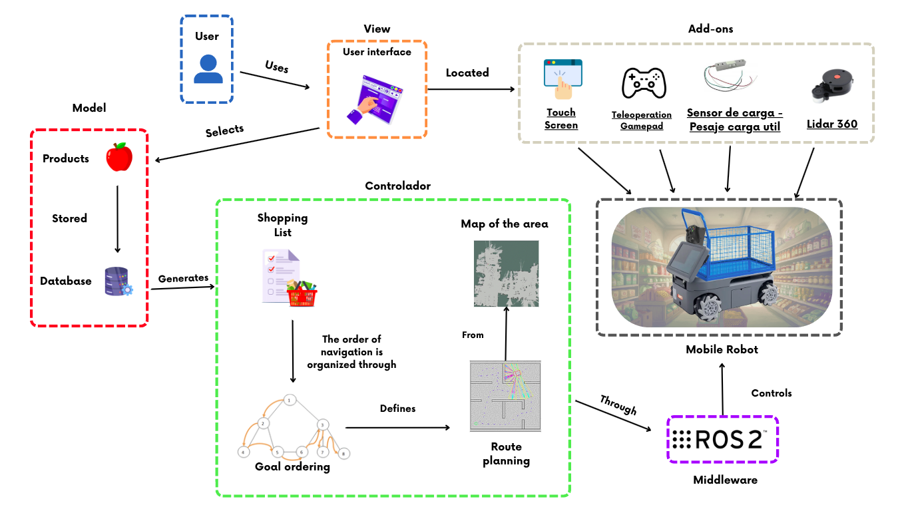

The software follows an MVC style split:

| Layer | Components |
|---|---|
| **Model** | SQLite product database (`database/products.db`), product/location records |
| **View** | Customer/worker app (`saragui.py`, `base_navgui.py`), catalog app (`workergui.py`), touchscreen |
| **Controller** | `ObstacleAvoidance`, `TeleoperationController`, `Navigator` (Nav2 wrapper), `WeightController`, all arbitrated through `TwistMux` |
| **Robot** | TurtleBot3 core, odometry, differential drive controller, weight sensor publisher |

### Hardware / comms

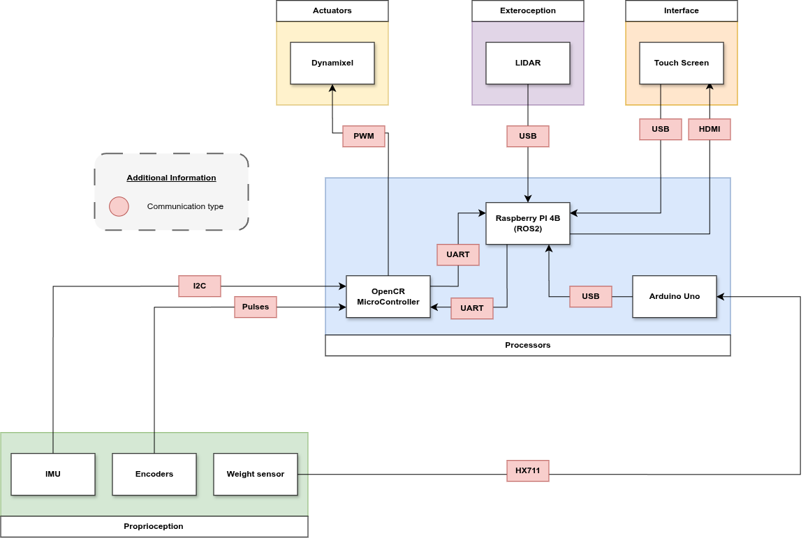

### Safety layer

A state machine built on lidar readings backs off, turns, and moves forward around unplanned obstacles, running alongside whatever navigation or teleop command is active. The weight sensor works the same way as an emergency topic: once a reading crosses the configured limit, it publishes a zero velocity command immediately, so the robot stops rather than push against an overloaded wheel. Both sit above navigation and teleop in the `twist_mux` priority table under [Key features](#key-features).

## Simulation vs. real environment

Both the Gazebo world and the physical test environment replicate the same 7x3 m retail aisle layout: three shelf units and a checkout zone. Each is mapped independently with Cartographer, so simulation and the real lab run on two distinct SLAM maps under the identical navigation and safety stack.

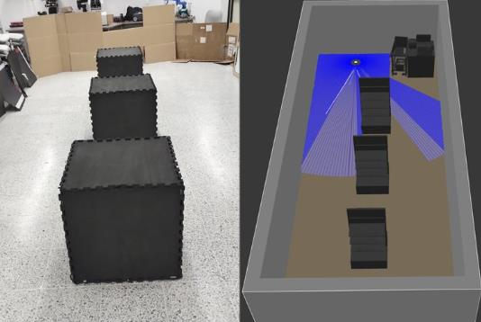

| | Simulation | Real robot |
|---|---|---|
| Environment | Gazebo model | Physical lab replica |
| Map | `supermarket_map.yaml` | `labrobfinal_mask.yaml` |
| Mapping launch file | `cartographerturtle.launch.py` | `real_cartographer.launch.py` |
| Navigation launch file | `navagv.launch.py` | `real_nav.launch.py` |

### A note on hardware evolution

The project originally targeted a **myAGV2023 Pi**, an AGV with mecanum wheels from an outside vendor, bridged into ROS 2 through `ROSBridge`. That path got abandoned. Navigation latency through the bridge was unworkable, the vendor's firmware was inaccessible, and the vendor's own odometry turned out to be unreliable: the internal IMU was disabled, odometry came from encoders alone, and combining linear and angular velocity commands produced erratic motor behavior. The final implementation instead rebuilds a modified **TurtleBot3 Waffle**, differential drive, reassembled from recovered TurtleBot3 Burger parts, with a custom acrylic/MDF/3D-printed basket, touchscreen mount, and load cell platform.

## Results

Measured over controlled lab trials (see the thesis for full methodology):

| Metric | Result |
|---|---|
| Navigation accuracy (avg. error, 50 trials) | 0.223 m (sigma = 0.058 m, range 0.155-0.495 m) |
| Navigation repeatability (consistency) | 98.7% (coefficient of variation 6.79% in route length) |
| Route efficiency vs. theoretical shortest path | 79.84% (2.69 m gap over a 10.67 m optimal 6-stop route) |
| Usability (System Usability Scale, n=21) | 85.24 / 100 average (SUS "acceptable" threshold is 68) |

<p float="left">
  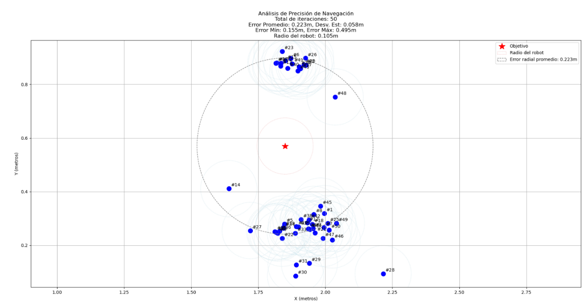
  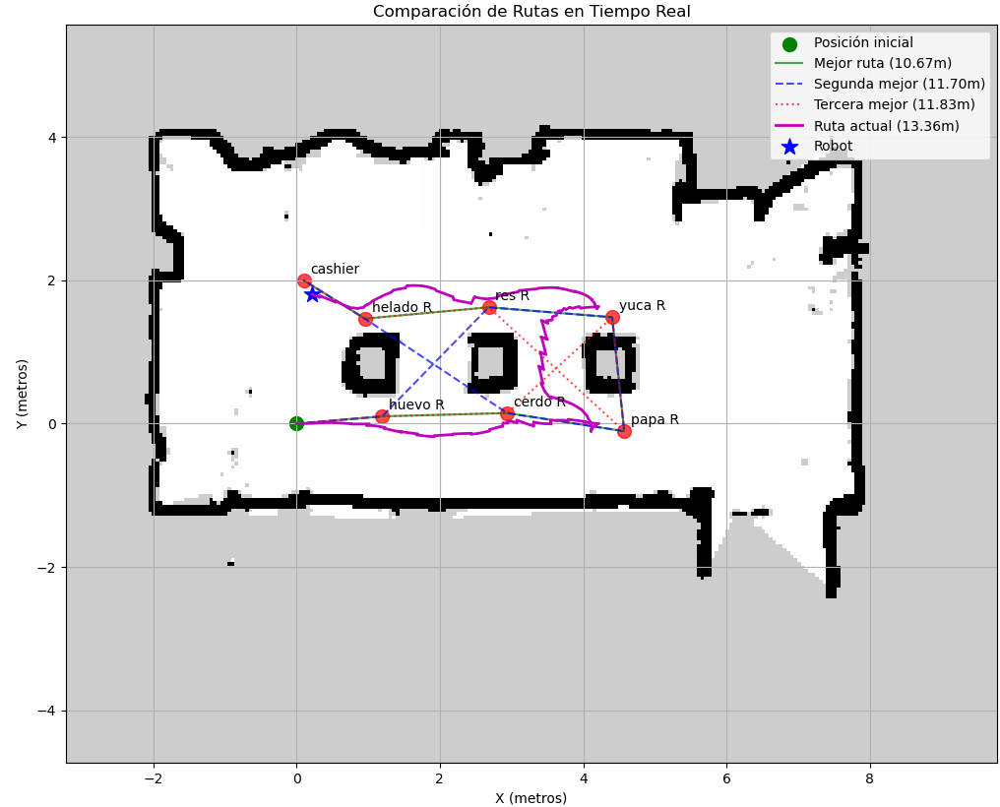
</p>

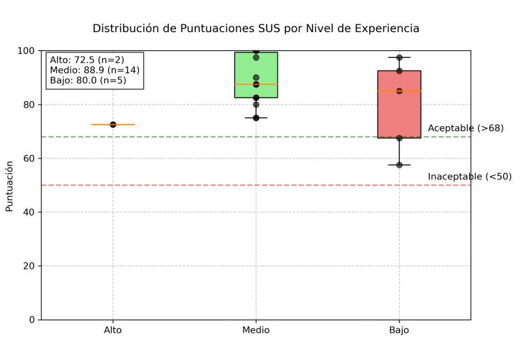

## Interface

**Customer / worker app (`saragui.py`)**

<p float="left">
  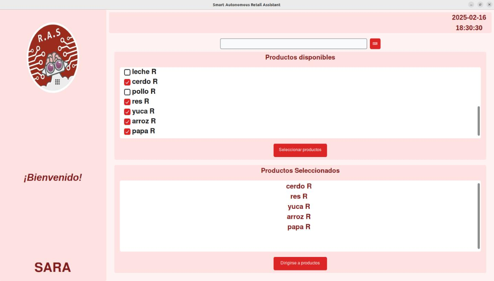
  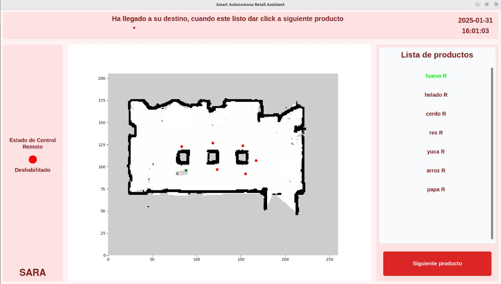
</p>

**Catalog app (`workergui.py`)**

<p float="left">
  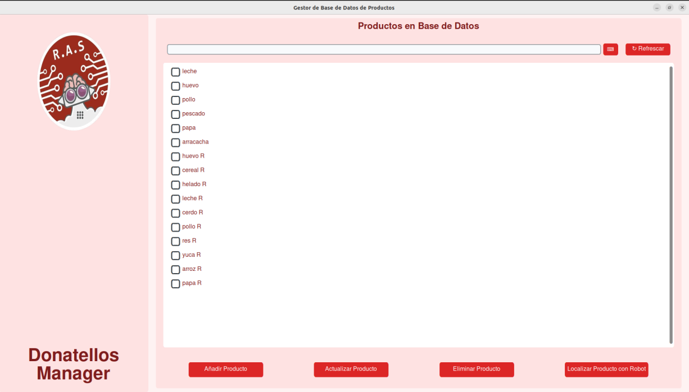
  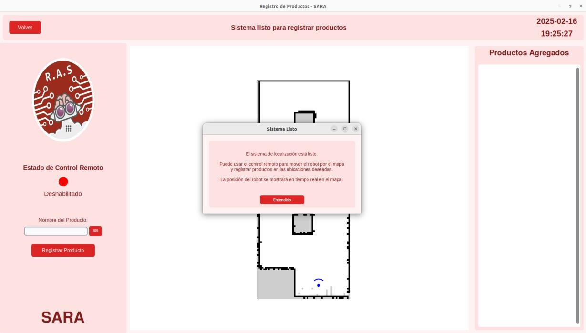
</p>

## Repository layout

```
scripts/      Python nodes: navigation, GUIs, safety layer, teleop, DB tooling
launch/       ROS 2 launch files (sim and real robot entry points)
params/       Nav2 / Cartographer parameter files (sim, real, supermarket variants)
maps/         Prebuilt occupancy grid maps (sim and real, mapped independently)
models/       URDF/Xacro robot description, Gazebo models
worlds/       Gazebo world files (supermarket, cafe, warehouse, etc.)
rviz/         RViz configs
config/       EKF, joystick, twist_mux configuration
database/     SQLite product database
docs/img/     Figures used in this README
```

## Getting started

**Requirements:** Ubuntu 22.04, ROS 2 Humble, Python 3.10.

```bash
# ROS 2 packages
sudo apt install ros-humble-desktop-full ros-humble-rmw-cyclonedds-cpp \
  ros-humble-robot-localization ros-humble-twist-mux \
  ros-humble-navigation2 ros-humble-nav2-bringup ros-humble-slam-toolbox \
  ros-humble-cartographer ros-humble-cartographer-ros \
  ros-humble-turtlebot3 ros-humble-turtlebot3-msgs ros-humble-dynamixel-sdk \
  ros-humble-tf-transformations ros-humble-gazebo-ros-pkgs sqlite3

# Python packages
sudo pip3 install transforms3d customtkinter
```

```bash
mkdir -p ~/superdev_ws/src && cd ~/superdev_ws/src
git clone https://github.com/dcapacho3/turtlemart.git
cd ~/superdev_ws && colcon build && source install/setup.bash

# So Gazebo can find the store/robot models:
echo 'export GAZEBO_MODEL_PATH=$GAZEBO_MODEL_PATH:~/superdev_ws/src/turtlemart/models' >> ~/.bashrc
```

`saragui.py` and `workergui.py` each have a `self.show_mode_selector` flag. Set it to `True` to expose a Real/Simulation toggle on the welcome screen instead of hardcoding one target.

### Running it

You don't launch navigation separately, the app does it for you:

```bash
ros2 run turtlemart saragui.py     # customer / worker select and navigate flow
ros2 run turtlemart workergui.py   # catalog manager
```

When you select destinations and start the flow, `saragui.py` (through `base_navgui.py`) launches `mux.launch.py` and, depending on the Real/Simulation mode selected on the welcome screen, either `real_nav.launch.py` or `navagv.launch.py`, as background processes. The full `twist_mux` plus Nav2 stack comes up automatically on first use instead of needing to be started by hand.

**Manual override:** gamepad teleop is already running once the app has launched the control stack. It doesn't need to be started separately, it just sits there listening for the controller's B button, which toggles whether teleop commands override autonomous navigation. Keyboard teleop is the one thing you do start yourself, in its own terminal:

```bash
ros2 run turtlemart key_teleop.py
```

**Building a new map** (only needed if you change the physical or simulated layout):

```bash
ros2 launch turtlemart cartographerturtle.launch.py   # simulation
ros2 launch turtlemart real_cartographer.launch.py    # real robot

# once satisfied with the mapped area:
ros2 run nav2_map_server map_saver_cli -f ~/superdev_ws/src/turtlemart/maps/<name>
```

The saved map's filename then needs to be pointed to from `navagv.launch.py` (simulation) or `real_nav.launch.py` (real robot), and from the `load_map()` path in `scripts/base_navgui.py`.

## Citation

If you build on this work, please cite:

```bibtex
@misc{capacho2025sara,
  author       = {Capacho Parra, David},
  title        = {Desarrollo de un sistema robótico para la conducción autónoma de carros de compra en entornos estructurados},
  howpublished = {Undergraduate (Bachelor's) thesis, Universidad Autónoma de Occidente},
  year         = {2025},
  url          = {https://hdl.handle.net/10614/16136}
}
```

## License

Apache License 2.0. See [LICENSE](LICENSE).

## Acknowledgments

Developed as an undergraduate thesis project under the direction of Javier Ferney Castillo García, Universidad Autónoma de Occidente, Programa de Ingeniería Mecatrónica.
